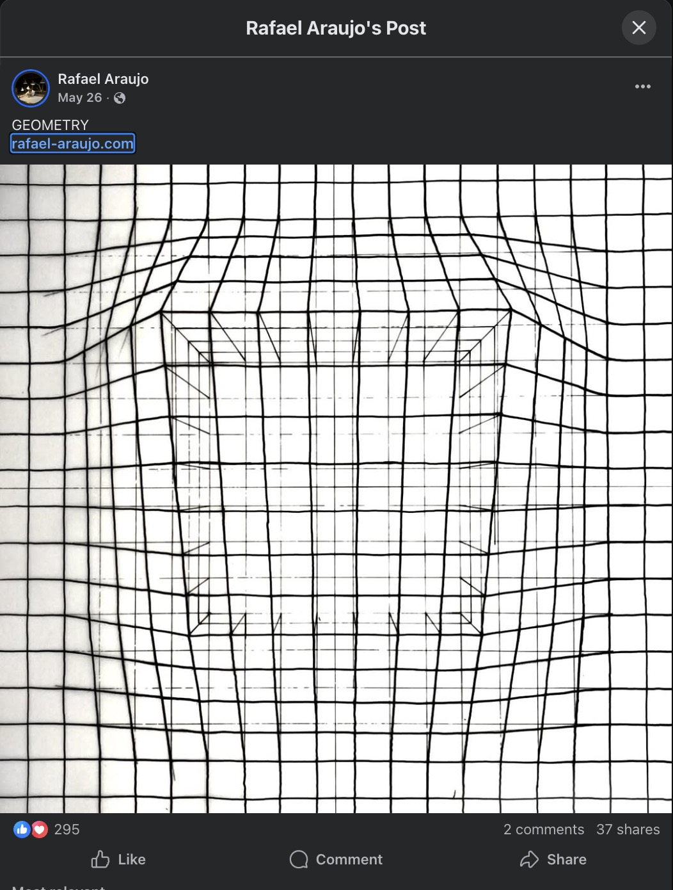
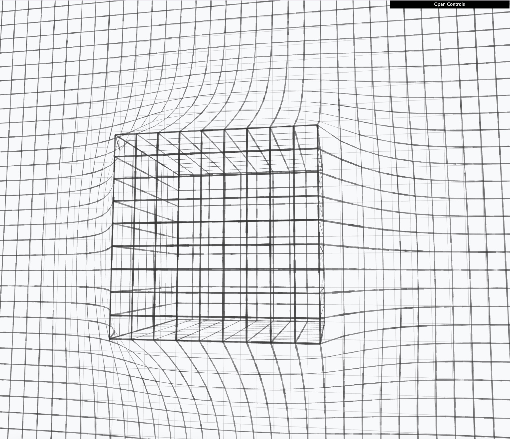

# Grid Drape Visualization

An interactive 3D visualization inspired by the geometric artwork of [Rafael Araujo](https://www.rafael-araujo.com/?fbclid=IwY2xjawOa6-tleHRuA2FlbQIxMABicmlkETFqWTQxT01LVW1iSDJ3eTFxc3J0YwZhcHBfaWQQMjIyMDM5MTc4ODIwMDg5MgABHufM2rWovi487ls7nOz2D4x7cOi2EZEWwKhaqNGr4W4LRt6Ir3gIBVOOFI1M_aem_ZmFrZWR1bW15MTZieXRlcw).

After seeing a social media post showcasing Araujo's beautiful hand-drawn geometric patterns, I was inspired to recreate this effect using code.

**Note: This project was developed with AI assistance.**

## 🔗 [Live Demo](https://stephanschulz.github.io/grid_cube/)

## Original Inspiration vs. Coded Version

<table>
<tr>
<td width="50%">

<em>Original artwork by Rafael Araujo</em>

</td>
<td width="50%">

<em>Interactive coded version</em>

</td>
</tr>
</table>

## About the Visualization

This project simulates a cloth-like grid draping over a 3D object (cube or sphere). The visualization follows these key principles:

### Drawing Rules

1. **Grid Structure**: A regular grid of lines is generated on a flat plane (the "floor")

2. **3D Object Interaction**: When a 3D shape (cube or sphere) is placed in the scene:
   - The grid "drapes" over the object like a cloth
   - Grid points are pushed upward where they intersect with the shape
   - The deformation smoothly propagates outward based on an influence radius

3. **Pencil Sketch Effect**: Lines are rendered with:
   - Variable thickness along their length (simulating pencil pressure)
   - Multi-octave noise for natural variation
   - Variable opacity to mimic hand-drawn strokes
   - No jitter - smooth, continuous lines

4. **Layering & Clipping**:
   - The shape is clipped at the floor level (no geometry extends below)
   - Three independent layers: back grid (floor), drape (deformed grid), and shape grid
   - Each layer has independent opacity and line width controls
   - Proper render ordering prevents visual artifacts

5. **Visual Consistency**:
   - All grids use odd-numbered divisions for perfect alignment
   - Grid spacing remains constant across all elements
   - The drape never penetrates below the collision surface

## Controls

Open the dat.GUI panel (top-right) to adjust:
- **Position**: Object position, size, and grid density
- **Appearance**: Opacity and line width for each layer
- **Rotation**: Rotate the 3D shape
- **Actions**: Toggle between cube/sphere, reset camera view

## Technical Implementation

- Built with Three.js for 3D rendering
- Custom shader material for pencil-like line rendering
- Ribbon mesh geometry for variable line thickness
- Multi-ray raycasting for accurate cloth simulation
- Laplacian smoothing for natural draping effect
